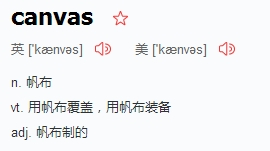
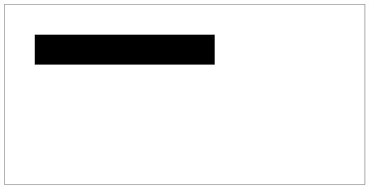
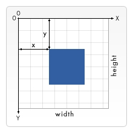
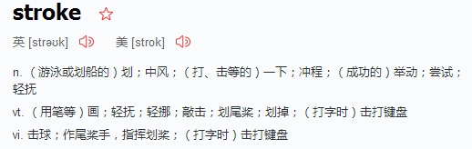
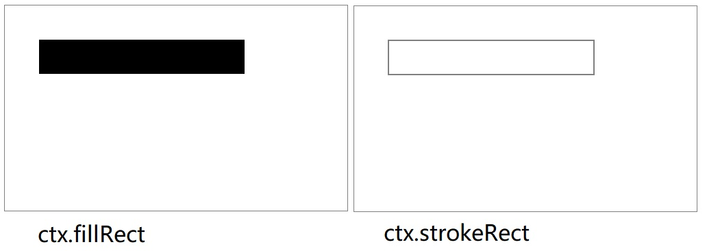
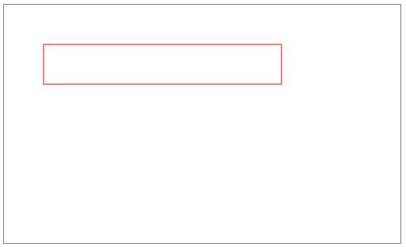
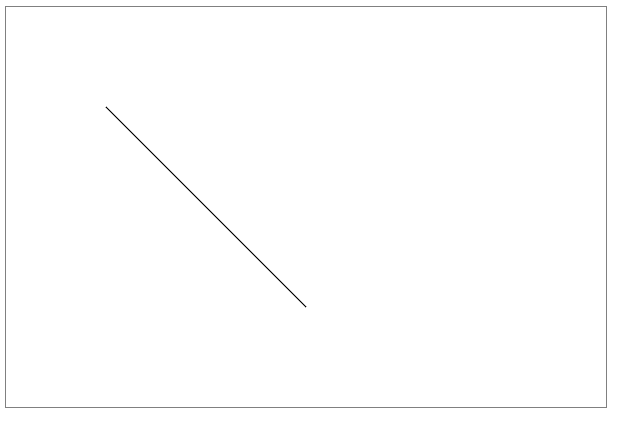
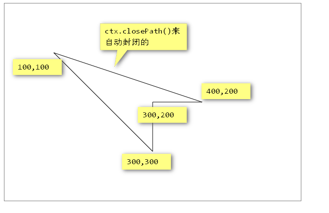

# Canvas画布


## 一、Canvas概述和Hello World

### 1.1 概述



Canvas是HTML5中新增的一个元素，它就像一块画布，可以用JavaScript在上面绘制各种图表、动画、制作游戏等。

在没有Canvas的年代，绘图只能借助Flash插件实现，页面不得不用JavaScript和Flash进行交互。有了Canvas，我们就再也不需要Flash了，直接使用JavaScript完成绘制。

<!--
WebGL也使用<canvas>元素在网页上绘制硬件加速的3D图形。
Canvas在我们眼中是一个在面试中极度加分的项目，并且完整的去检验大家内功水平，全是面向对象。
-->

### 2.1 HelloWorld

`<canvas>`是一个标签，有一个默认的宽度，不需要了解。此时注意，如果我们要设置宽度、高度，必须设置在HTML标签上面，而不能设置在CSS上。

```
<!DOCTYPE html>
<html>
<head>
<meta charset="utf-8">
<title>Canvas画布 - HelloWorld</title>
<style type="text/css">
    canvas {
        border: 1px solid gray;
    }
</style>
</head>
<body>
<canvas id="myCanvas" width="600" height="300"></canvas>
</body>
</html>
```

我们必须使用JavaScript来控制Canvas渲染各种东西：

```
<script>
    // 使用DOM方法得到画布
    var myCanvas = document.getElementById("myCanvas");
    // 使用画布的上下文
    var ctx = myCanvas.getContext("2d");
    // 画各种东西，用ctx打点调用方法，而不是myCanvas
    ctx.fillRect(50, 50, 300, 50);
</script>
```

设置后的效果如下图：



上面的例子中，我们就学习了两个API：

```
myCanvas.getContext("2d");
```

`get`表示得到，`context`是上下文的意思。

canvas起初是空白的。为了展示，首先脚本需要找到渲染上下文，然后在它的上面绘制。`<canvas>`元素有一个做`getContext()`的方法，这个方法是用来获得渲染上下文和它的绘画功能。getContext()只有一个参数，上下文的格式。

```
ctx.fillRect(x,y,w,h)
```

`fill`是填充的意思，`rect`是`rectangle`矩形。填充一个矩形。


<span style="color: red;">**注意事项：**</span>

(1)、canvas的ctx对象，非常重要所有的绘制都是ctx的方法。

```
<script>
    // 使用DOM方法得到画布
    var myCanvas = document.getElementById("myCanvas");
    //使用画布的上下文
    var ctx = myCanvas.getContext("2d");
    // 画各种东西，用ctx打点调用方法，而不是myCanvas
    ctx.fillRect(50, 50, 300, 50);

    // canvas所有的绘制API都是基于ctx的事情，而不是canvas对象
    ctx.fillStyle = "lightgreen";
    ctx.beginPath();
    ctx.arc(250, 250, 100, 0, Math.PI * 2, true);
    ctx.fill();
    ctx.closePath();
</script>
```

(2)、canvas的坐标系



(3)、canvas兼容到IE9


## 二、笔触和填充

Canvas中能够产生颜色的是两个东西，一个叫做笔触（我们通常叫描边），一个叫做填充。

### 2.1 快速绘制矩形

canvas提供了三种方法绘制矩形：

`fillRect(x, y, width, height)`     绘制一个填充的矩形

`strokeRect(x, y, width, height)`   绘制一个矩形的边框

`clearRect(x, y, width, height)`    清除指定矩形区域，让清除部分完全透明。

上面提供的方法之中每一个都包含了相同的参数。x与y指定了在canvas画布上所绘制的矩形的左上角（相对于原点）的坐标。`width`和`height`设置矩形的尺寸。



```
<script>
    // 使用DOM方法得到画布
    var myCanvas = document.querySelector("myCanvas");
    // 使用画布的上下文
    var ctx = myCanvas.getContext("2d");
    //笔触
    ctx.strokeRect(50, 50, 300, 50);
</script>
```

对比：



设置笔触的颜色：

```
ctx.strokeStyle = "red"; //设置笔触颜色
ctx.strokeRect(50, 50, 300, 50); //画一个边框
```


现在我们只能画一个矩形，如果我们想要画任意笔触呢？


### 2.2 线

canvas中可以允许我们绘制自定义的笔触，绘制直线非常简单：



```
ctx.beginPath(); //开始画线
ctx.moveTo(100, 100); //将画笔移动到一个位置
ctx.lineTo(300, 300); //用画笔画，此时是抽象的一个线，没有显示在画布上
ctx.stroke(); //划线
```

可以多次使用lineTo：



绘制的线，也可以用fill填充，并且可以用strock来描边。需要注意的是，形状如果不封闭就fill了，此时形状会自动封闭。

可以用`ctx.lineWidth = "5"`  来设置宽度。

