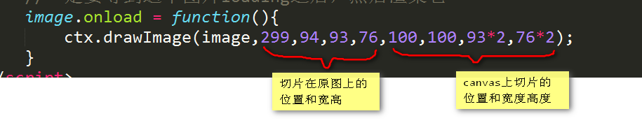
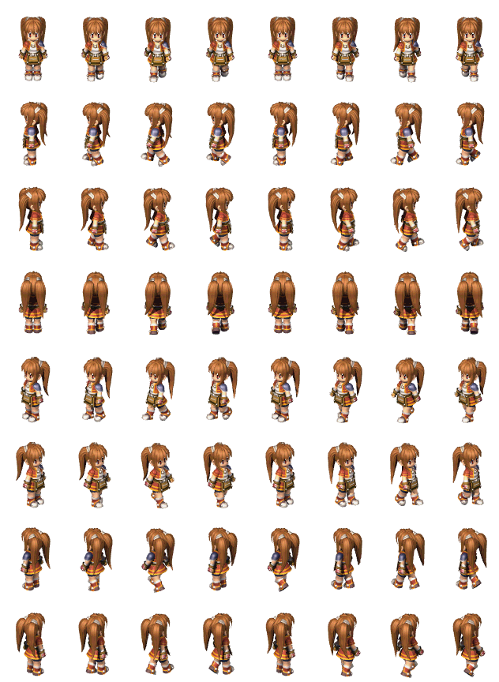

# Canvas画布


## 一、Canvas概述和Hello World

### 1.1 概述


Canvas是HTML5中新增的一个元素，它就像一块画布，可以用JavaScript在上面绘制各种图表、动画、制作游戏等。

在没有Canvas的年代，绘图只能借助Flash插件实现，页面不得不用JavaScript和Flash进行交互。有了Canvas，我们就再也不需要Flash了，直接使用JavaScript完成绘制。

<!--
WebGL也使用<canvas>元素在网页上绘制硬件加速的3D图形。
Canvas在我们眼中是一个在面试中极度加分的项目，并且完整的去检验大家内功水平，全是面向对象。
-->

### 2.1 HelloWorld

`<canvas>`是一个标签，有一个默认的宽度，不需要了解。此时注意，如果我们要设置宽度、高度，必须设置在HTML标签上面，而不能设置在CSS上。

```
<!DOCTYPE html>
<html>
<head>
<meta charset="utf-8">
<title>Canvas画布 - HelloWorld</title>
<style type="text/css">
    canvas {
        border: 1px solid gray;
    }
</style>
</head>
<body>
<canvas id="myCanvas" width="600" height="300"></canvas>
</body>
</html>
```

我们必须使用JavaScript来控制Canvas渲染各种东西：

```
<script>
    // 使用DOM方法得到画布
    var myCanvas = document.getElementById("myCanvas");
    // 使用画布的上下文
    var ctx = myCanvas.getContext("2d");
    // 画各种东西，用ctx打点调用方法，而不是myCanvas
    ctx.fillRect(50, 50, 300, 50);
</script>
```

设置后的效果如下图：


上面的例子中，我们就学习了两个API：

```
myCanvas.getContext("2d");
```

`get`表示得到，`context`是上下文的意思。

canvas起初是空白的。为了展示，首先脚本需要找到渲染上下文，然后在它的上面绘制。`<canvas>`元素有一个做`getContext()`的方法，这个方法是用来获得渲染上下文和它的绘画功能。getContext()只有一个参数，上下文的格式。

```
ctx.fillRect(x,y,w,h)
```

`fill`是填充的意思，`rect`是`rectangle`矩形。填充一个矩形。


<span style="color: red;">**注意事项：**</span>

(1)、canvas的ctx对象，非常重要所有的绘制都是ctx的方法。

```
<script>
    // 使用DOM方法得到画布
    var myCanvas = document.getElementById("myCanvas");
    //使用画布的上下文
    var ctx = myCanvas.getContext("2d");
    // 画各种东西，用ctx打点调用方法，而不是myCanvas
    ctx.fillRect(50, 50, 300, 50);

    // canvas所有的绘制API都是基于ctx的事情，而不是canvas对象
    ctx.fillStyle = "lightgreen";
    ctx.beginPath();
    ctx.arc(250, 250, 100, 0, Math.PI * 2, true);
    ctx.fill();
    ctx.closePath();
</script>
```

(2)、canvas的坐标系


(3)、canvas兼容到IE9


## 二、笔触和填充

Canvas中能够产生颜色的是两个东西，一个叫做笔触（我们通常叫描边），一个叫做填充。

### 2.1 快速绘制矩形

canvas提供了三种方法绘制矩形：

`fillRect(x, y, width, height)`     绘制一个填充的矩形

`strokeRect(x, y, width, height)`   绘制一个矩形的边框

`clearRect(x, y, width, height)`    清除指定矩形区域，让清除部分完全透明。

上面提供的方法之中每一个都包含了相同的参数。x与y指定了在canvas画布上所绘制的矩形的左上角（相对于原点）的坐标。`width`和`height`设置矩形的尺寸。


```
<script>
    // 使用DOM方法得到画布
    var myCanvas = document.querySelector("myCanvas");
    // 使用画布的上下文
    var ctx = myCanvas.getContext("2d");
    //笔触
    ctx.strokeRect(50, 50, 300, 50);
</script>
```

对比：


设置笔触的颜色：

```
ctx.strokeStyle = "red"; //设置笔触颜色
ctx.strokeRect(50, 50, 300, 50); //画一个边框
```


现在我们只能画一个矩形，如果我们想要画任意笔触呢？


### 2.2 线

canvas中可以允许我们绘制自定义的笔触，绘制直线非常简单：


```
ctx.beginPath(); //开始画线
ctx.moveTo(100, 100); //将画笔移动到一个位置
ctx.lineTo(300, 300); //用画笔画，此时是抽象的一个线，没有显示在画布上
ctx.stroke(); //划线
```

可以多次使用lineTo：


绘制的线，也可以用fill填充，并且可以用strock来描边。需要注意的是，形状如果不封闭就fill了，此时形状会自动封闭。

可以用`ctx.lineWidth = "5"`  来设置宽度。


## 三、弧和圆形

绘制圆弧或者圆，我们使用arc()方法。

公式：

`ctx.arc(x, y, radius, startAngle, endAngle, anticlockwise)`

画一个以（x,y）为圆心的以radius为半径的圆弧（圆），从startAngle开始到endAngle结束，按照anticlockwise给定的方向（默认为顺时针）来生成。

**一定要注意，canvas中角度是弧度制。**复习一下弧度制，就是在一个圆形披萨饼中，切一片披萨，让弧度边长等于圆的半径。此时无论圆形多大，此时切下来的角度是固定的，都是57.29度，成为1弧度，记做1rad。


角度值和弧度制的换算：`360° = 2 * PI rad`

例：画1弧度的圆弧
```
// 使用DOM方法得到画布
var myCanvas1 = document.querySelector("#myCanvas1");
// 使用画布的上下文
var ctx = myCanvas1.getContext("2d");

// 弧也是笔触
ctx.beginPath();
ctx.arc(200, 200, 100, 0, 1, true); // 设置路径
ctx.stroke(); // 画圆弧
```


例：绘制一个完整的圆形

```
ctx.arc(200, 200, 100, 0, 2 * Math.PI, false);
```


_完整的圆形，无所谓顺时针还是逆时针。_


## 四、Canvas的动画

要让元素在canvas上运动起来，需要使用`setInterval()`。

canvas使用了一个特别特殊的模式，上屏的元素，立刻被像素化。也就是说，上屏幕的元素，你将得不到这个“对象”的引用。比如，一个圆形画到了ctx上面，此时就是一堆像素点，不是一个整体的对象了，你没有任何变量能够得到这个圆形，改变这个圆形的x、y。也就是说，这种“改变”的思路在canvas中是行不通的。

要实现动画，我们必须：**每帧重新画一个**

所以canvas的画图的原理就是：

清屏 → 重绘 → 清屏 → 重绘  → 清屏 → 重绘 → 清屏 → 重绘  → …… 的一个过程

例：向右移动的圆形
```
// 使用DOM方法得到画布
var myCanvas1 = document.querySelector("#myCanvas1");
// 使用画布的上下文
var ctx = myCanvas1.getContext("2d");

var x = 100;
setInterval(function() {
    if (x > 500) x = 100;
    x++;
    //清屏
    ctx.clearRect(0, 0, 600, 400);
    //绘制一个新圆形
    ctx.beginPath();
    ctx.arc(x, 100, 50, 0, Math.PI * 2, true);
    ctx.closePath();
    ctx.fillStyle = "orange";
    ctx.fill();
}, 20);
```

注意API：

`ctx.clearRect(x,y,w,h);` 清除一个矩形区域，事实上，我们永远清除整个画布。


## 五、上升到面向对象

再来一个圆形向右移动，注意不管页面上有几个元素在运动，一定只有1个定时器。

定时器负责每帧清屏一次，然后重绘所有元素。但是每一个元素的信息、状态都不同，这时我们难以维护。

所以，我们不要在用全局变量来维护某一个小球的x、y、r、speed等信息，而是应该用对象来封装它。

```
// 使用DOM方法得到画布
var myCanvas1 = document.querySelector("#myCanvas1");
// 使用画布的上下文
var ctx = myCanvas1.getContext("2d");

//构造函数，圆类
function Ball(x, y, r, speed, color) {
    this.x = x; //坐标x
    this.y = y; //坐标y
    this.r = r; //半径
    this.speed = speed; //速度
    this.color = color; //颜色
    //将自己推入数组
    actorsArr.push(this);
}
//渲染方法
Ball.prototype.render = function() {
    ctx.beginPath();
    ctx.arc(this.x, this.y, this.r, 0, Math.PI * 2, true);
    ctx.closePath();
    ctx.fillStyle = this.color;
    ctx.fill();
}
//更新方法
Ball.prototype.update = function() {
    if (this.x > 500) this.x = 70;
    this.x += this.speed;
}

//演员数组
var actorsArr = [];
//实例化一些小球，他们都自动可以动画
new Ball(70, 70, 30, 1, "red");
new Ball(70, 150, 40, 2, "orange");
new Ball(70, 250, 50, 3, "blue");
new Ball(70, 370, 60, 4, "green");

//帧编号
var fno = 0;
//唯一的一个定时器
setInterval(function() {
    //清屏
    ctx.clearRect(0, 0, myCanvas1.width, myCanvas1.height);
    //打印帧编号
    fno++;
    ctx.fillStyle = "black";
    ctx.fillText("帧编号：" + fno, 20, 20)
    //更新、渲染所有演员
    for (var i = 0; i < actorsArr.length; i++) {
        actorsArr[i].update();
        actorsArr[i].render();
    }
}, 20);
```

让所有的演员（就是上画布的元素），都要进入数组。在定时器中，每一帧更新所有演员，渲染所有演员。


## 六、使用图片

canvas中不可能所有的形状都自己画，一定是设计师给我们素材，我们使用。

### 6.1 基本使用

canvas中使用图片，使用`drawImage`函数，但是有一个事儿必须注意，必须等`img`完全加载之后才能呈递图片。

**标准套路如下：**

```
// 创建一个img对象的节点
var image = new Image();
image.src = "./img/cat_200.jpg";
// 一定要等到这个图片loading之后，然后渲染它
image.onload = function() {
    ctx.drawImage(image, 30, 30);
}
```

image.onload这个壳子不能省略。

(1)、上面的例子，我们仅仅使用两个数字参数，表示图片的x、y：

```
ctx.drawImage(图片对象, dx, dy);
```


图片会1:1的呈递。

(2)、可以使用4个数字参数，此时可以设置图片的高度、宽度，如下：

```
ctx.drawImage(image, 30, 30, 200, 140);
```


(3)、实际上我们还可以使用类似CSS中精灵的切片，比如，我们现在想在canvas上面呈递切片中的位置：


将这个切片，放置在画布的`100,100`，显示的宽度、高度是切片2倍，如下：

```
ctx.drawImage(image, 299, 94, 93, 76, 100, 100, 93 * 2, 76 * 2);
```

说明：



来看看MDN上面的解释：[链接](https://developer.mozilla.org/zh-CN/docs/Web/API/Canvas_API/Tutorial/Using_images#Slicing)

```
drawImage(image, sx, sy, sWidth, sHeight, dx, dy, dWidth, dHeight)
```

第一个参数和其它的是相同的，都是一个图像或者另一个 canvas 的引用。其它8个参数，前4个是定义图像源的切片位置和大小，后4个则是定义切片的目标显示位置和大小。


**实例：**使用精灵制作小女孩的行走



实现代码：
```
var image = new Image();
image.src = "./img/girl.png";

var step = 0;
var x = 50;
image.onload = function() {
    setInterval(function() {
        //清屏
        ctx.clearRect(0, 0, 800, 400);
        step++;
        if (step > 7) {
            step = 0;
        }
        if (x > 700) x = 50;
        x += 4;
        ctx.drawImage(image, 79 * step, 108 * 2, 79, 108, x, 100, 79, 108)
    }, 40);
}
```


**到此，我们已经学会了Canvas的基本功能和API，更多功能及API请查看MDN的文档 [链接](https://developer.mozilla.org/zh-CN/docs/Web/API/Canvas_API)**