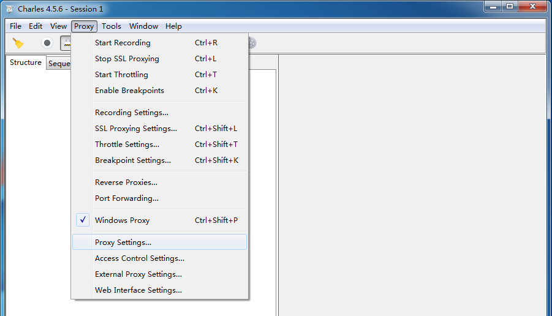
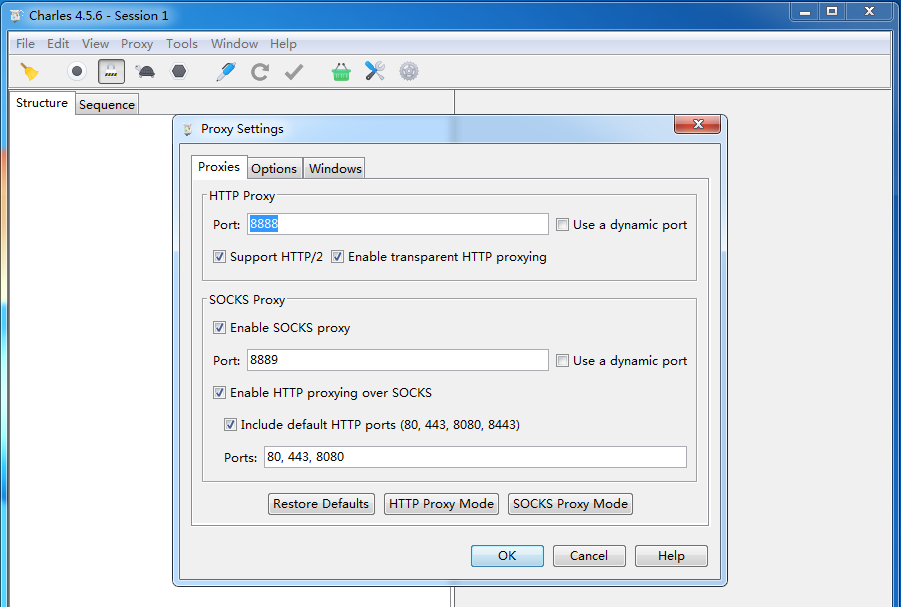
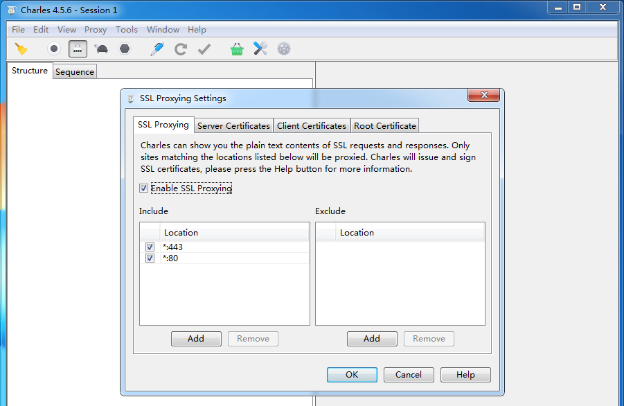
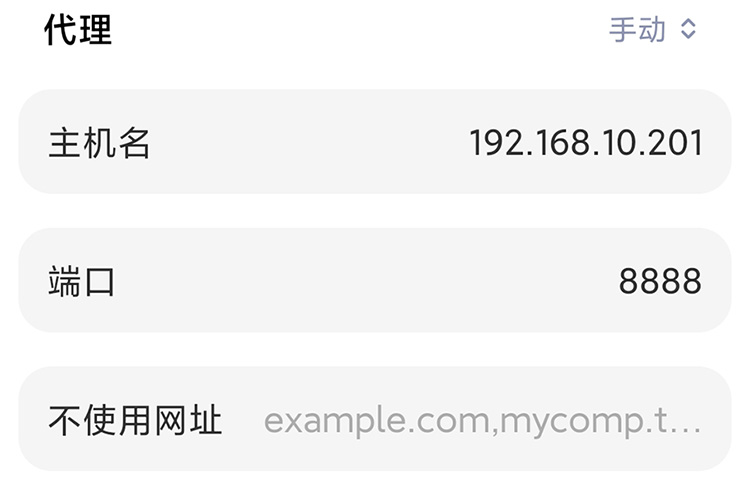
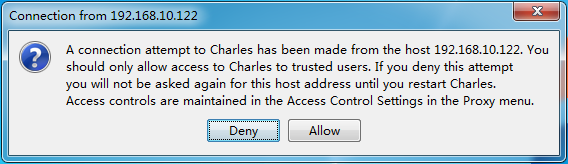
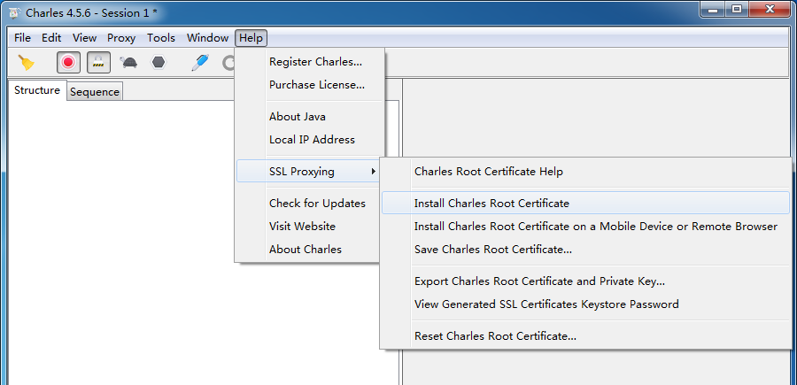

# 使用 Charles 进行 HTTPS 抓包

**背景：**

在进行App测试或定位线上问题时，经常会遇到抓取HTTPS数据包的需求。对于https请求，抓到的数据因为经过了加密，只能看到乱码。本文介绍如何使用Charles来抓取https网络报文。

**操作原理**

关键的操作思想：

1. 构造一个中间人代理，它有能力完成TLS/SSL握手

2. 弄到一个根证书，并用它生成签名认证的代理服务器证书

<!-- > Charles就是一个理想的中间人，它支持SSL握手，可以自动根据根证书生成一个签名的服务器证书，并且它的官网为我们提供了一个根证书。
> 
> 我们要做的就是在客户端安装好这个根证书，然后让我们的操作系统信任它。对App来说，需要设法在IOS或Android上装上这个官网提供的根证书。
> 
> 完成上述步骤后，App再指定Charles为它的代理服务器，这时，App请求的服务器证书就是Charles自动生成的代理服务器证书。如果Charles的根证书已被信任，这个自动生成的代理服务器证书是有效的，使用它App和Charles的TLS握手可以顺利完成。 -->

**分步指南**

### 第一步：配置HTTP代理，这步与抓取HTTP请求是一样的：

<!--  -->

选择在8888端口上监听，然后确定。够选了SOCKS proxy，还能截获到浏览器的http访问请求。

<!--  -->

### 第二步：配置SSL代理：

首先在charles的 Proxy 选项选择 SSL Proxy Settings

<!--  -->

然后在弹出的对话框中点击add，添加需要监视的域名。域名支持 * 号通配符，如：抓取所有的https请求，可以填写 *:443

如果想要抓取 qq.com 的域名，可以填写 *.qq.com

### 第三步：为手机设置代理

在手机无线中配置手动代理，输入安装Charles的电脑的网络地址，端口填8888。

手机首次连接后，Charles会弹出是否允许连接的提示，选择“Allow”即可。

### 第四步：安装根证书

**在手机上安装Charles的根证书：**

IOS

在Safri上打开Charles的根证书下载网址： chls.pro/ssl 。

顺利的话会出现这样的画面，继续点安装，一路点确定。然后去设置里的描述文件管理如果看到有绿色的勾勾就说明安装成功了。

接下来，在设置->通用->关于本机->证书信任设置 （这一步很重要） 刚刚安装的证书的开关打开信任就可以抓取加密包了。

如果不能下载，检查手机是否正确设置了代理，Charles是否已经打开并配置正确。

Android<!-- 7.0 之后抓包 unknown 和证书无效的解决方案 -->

在浏览器上打开Charles的根证书下载网址： chls.pro/ssl ，安装证书。

如果无法安装的话，需要手动安装证书(需root)。

> 系统证书目录：`/system/etc/security/cacerts/`
> 
> 其中的每个证书的命名规则如下：
> 
> `<Certificate_Hash>.<Number>`
> 
> 文件名是一个Hash值，而后缀是一个数字。
> 
> 文件名可以用下面的命令计算出来：
> 
> `openssl x509 -subject_hash_old -in <Certificate_File>`
> 这个<Certificate_File> 就是你下载的证书的名字，你计算出hash值以后，就把原来证书的名字，就是这个<Certificate_File>，改成hash值点Number的格式（<Certificate_Hash>.<Number>的格式）
> 
> 后缀名的数字是为了防止文件名冲突的，比如如果两个证书算出的Hash值是一样的话，那么一个证书的后缀名数字可以设置成0，而另一个证书的后缀名数字可以设置成1

这里可以选择使用《夜神模拟器》来代替手机，默认安装好就已经是root了的。

**电脑端的根证书安装**

直接在Charles的 Help 菜单中安装；安装完成后去系统的钥匙串访问中信任它。

<!--  -->

完成后：试试看抓一下QQ空间的数据，将*.qq.com 添加到SSL Proxy的Setting中后，配置好手机代理，打开手机QQ空间App。可以看到抓取到的报文如下：

<!-- **几点说明：**

- 有些人认为https可以完美防止中间人攻击，无法抓到https的明文包...... 其实是不对的，TLS的设计只能说是从技术上最大限度地保护网络报文的安全，它无法防止用户自己作死。
- 网络安全和用户的安全意识是强相关的，技术的防范能力总是有限的。在实际生活中养成良好的上网习惯，千万不能随意信任不明来源的证书，轻视浏览器、操作系统或其他App给我们发出的安全警告。

 -->

